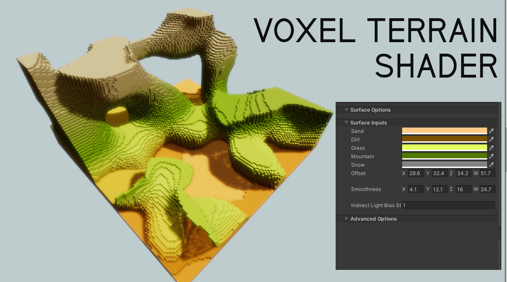
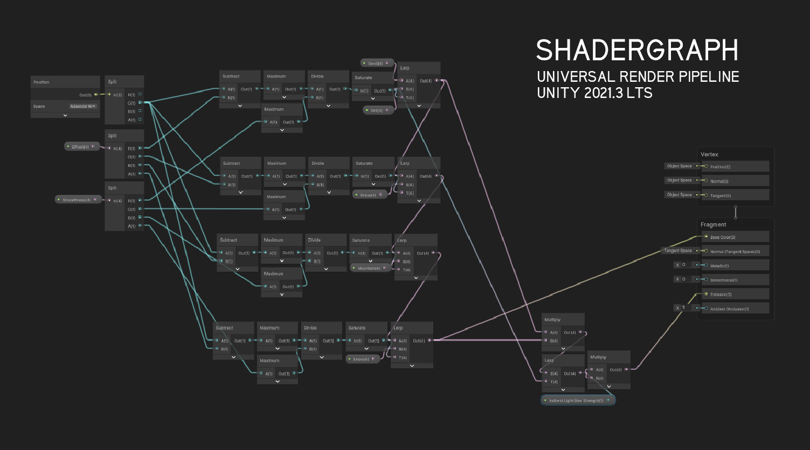

# Terrain Shader for Voxel Terrain
Sebuah shader yang digunakan untuk mewarnai terrain agar terlihat halus dan bergradasi.
Pewarnaannya berdasarkan pada offset nilai y, bukan xz.

# Installation Requirements
1. Unity Engine 2021.3 LTS (minimum)
2. URP Version 12.1.6 (minimum)

# Example Usage

Variables:
- Offset adalah 4 buah nilai (floating point) yang digunakan untuk membuat batasan dari satu warna ke warna lainnya.
- Smoothness adalah nilai yang digunakan untuk memberikan seberapa jauh transisi yang akan dipakai dari satu warna ke warna lainnya.
- Indirect Light Bias adalah nilai yang digunakan untuk mengatur pengcahayaan tidak langsung (indirect lighting). Umumnya bernilai 1.
# Cara Pemakaian
1. Buatlah material baru dengan shader bernama "TerrainVoxelShader"
2. Taruh material tersebut ke mesh
3. Atur nilai-nilai dari setiap variabel
